---
<!--
class: title
_backgroundColor: orange
-->

# 想定問題集

---
<!--
class: slides
-->

## 問題１

### 位相回転するゲートは？

1. Xゲート
2. Yゲート
3. Zゲート
4. Tゲート
5. Sゲート

答えはこちら

Z軸の周りを回転することを位相回転（Phase flip）という

3. Zゲート
4. Tゲート
5. ゲート

---

## 問題２

### ビット反転するゲートは？

1. Xゲート
2. Zゲート
3. Tゲート
4. Sゲート

答えはこちら

パウリX行列をつかうと|0>が|1>に|1>が|0>になる。これをビット反転（bit flip）という.

1. Xゲート

---

## 問題３

### 下記を実行すると、量子状態はどうなりますか1？

答えはこちら

アダマールゲートのあとCCXゲートを通している事を確認してください

Bell状態になります

---

## 問題４

### 下記を実行すると、量子状態はどうなりますか2？

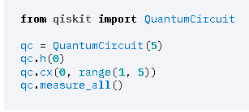

答えはこちら

GHZ状態になります

---

## 問題５

### 下記と等価なゲートは1？

答えはこちら

図と同じゲートはZゲートになります

---

## 問題６

### 下記と等価なゲートは2？

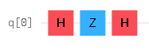

答えはこちら

図と同じゲートはXゲートになります

---

## 問題７

### Sゲートのフェーズの値は？

1. π/2
2. π/4
3. π/8
4. π

答えはこちら

1. π/2

---

## 問題８

### Tゲートのフェーズの値は？

1. π/2
2. π/4
3. π/8
4. π

答えはこちら

2. π/4

---

## 問題９

### QuantumCircuit　正しくない記述は？

1. QuantumCircuit(QuantumRegister(4))
2. QuantumCircuit(QuantumRegister(4), ClassicalRegister(3))
3. QuantumCircuit(QuantumRegister(4, 'qr0'), QuantumRegister(2, 'qr1'))
4. QuantumCircuit（4,4)
5. QuantumCircuit（cr,qr)
6. qr = QuantumRegister(2) 
  cr = ClassicalRegister(2) 
  qc = QuantumCircuit(cr[0:2],qr[0:2])

答えはこちら

すべて正しい記述です。

---

## 問題10

### Measure　正しくない記述は？

1. circuit = QuantumCircuit(2, 2) 
  circuit.measure([0,1], [0,1])
2. circuit = QuantumCircuit(2, 2) 
  circuit.measure(0, 0) 
  circuit.measure(1, 1)
3. qreg = QuantumRegister(2, "qreg") 
  creg = ClassicalRegister(2, "creg") 
  circuit = QuantumCircuit(qreg, creg) 
  circuit.measure(qreg, creg)
4. circuit = QuantumCircuit(qreg, creg) 
  circuit.measure(qreg[0], creg[0])

答えはこちら

回答作成中です

---

## 問題11

### plot_histogram()のオプションで、ラベルを追加するのは？

1. legend
2. short
3. number_to_keep
4. bar_labels

答えはこちら

ラベルは1.legendオプションで追加します。 
ラベルに表記する文字は、リストとして渡す必要があります。

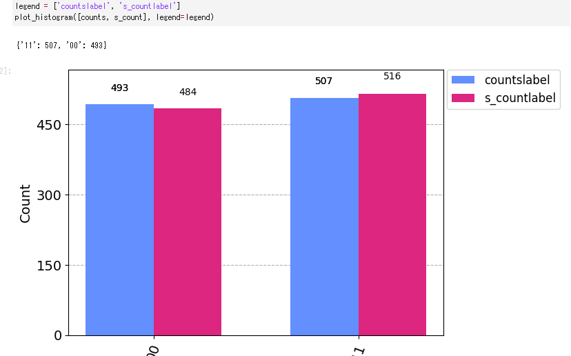

---

## 問題12

### plot_histogram()のオプションで、バーの色を変更するのは？

1. legend
2. color
3. number_to_keep
4. bar_labels

答えはこちら

ラベルは2.colorオプションで変更します。 

---

## 問題13

### 以下のコードで出力されるのはどちらですか？
qc = QuantumCircuit(2) 
qc.h(0) 
qc.cx(0, 1) 
 
state = DensityMatrix(qc) 
plot_state_city(state) 

1.   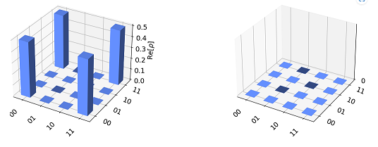

2.   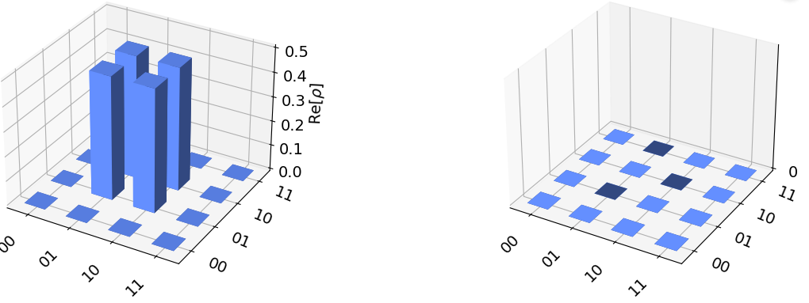

答えはこちら

1.が正解です。bell状態をplot_state_cityで表示したものです。
2,は 
qc.h(0) 
qc.x(0) 
qc.cx(0, 1) 
の状態です 
plot_state_cityは状態行列の実部と虚部が都市のようにプロットされている、量子状態の標準的なビュー。

---

## 問題14

### 以下のコードで出力されるのはどちらですか？
qc = QuantumCircuit(2) 
qc.h(0) 
qc.cx(0, 1) 
 
state = DensityMatrix(qc) 
plot_state_hinton(state) 

1.   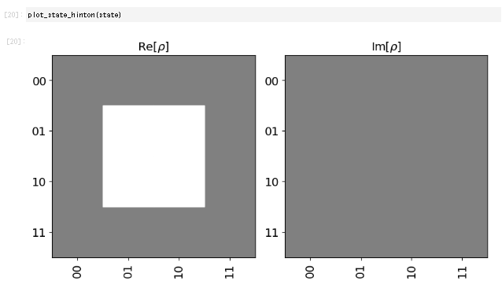

2.   

答えはこちら

1.が正解です。bell状態をplot_state_cityで表示したものです。
2,は 
qc.h(0) 
qc.x(0) 
qc.cx(0, 1) 
の状態です 

---

## 問題15

### 下記のコードで出力されるのは？
 Importing standard Qiskit libraries
from qiskit.quantum_info import random_statevector, random_unita

random_statevector(2)

1. Operator([[ 0.74182434-0.14258211j,  0.03447796+0.65435332j],
          [ 0.13139464-0.64195206j, -0.71237596-0.25130361j]],
         input_dims=(2,), output_dims=(2,))

2. Statevector([ 0.13919545-0.10896992j, -0.24642315-0.95290389j],
            dims=(2,))

3. Statevector([ 0.22981074-0.11260163j, -0.42290579+0.31550685j,
              0.46396693+0.58555583j, -0.21718184-0.22539993j],
            dims=(2, 2))

4. Operator([[ 0.74182434-0.14258211j,  0.03447796+0.65435332j],
          [ 0.13139464-0.64195206j, -0.71237596-0.25130361j]],
         input_dims=(2,), output_dims=(2,))

答えはこちら

2．が正解です。

---

### 問題16 下記のコードで出力されるのは？
Importing standard Qiskit libraries
from qiskit.quantum_info import random_statevector, random_unita

random_unitary(2)

1. Operator([[ 0.74182434-0.14258211j,  0.03447796+0.65435332j],
          [ 0.13139464-0.64195206j, -0.71237596-0.25130361j]],
         input_dims=(2,), output_dims=(2,))

2. Statevector([ 0.13919545-0.10896992j, -0.24642315-0.95290389j],
            dims=(2,))

3. Statevector([ 0.22981074-0.11260163j, -0.42290579+0.31550685j,
              0.46396693+0.58555583j, -0.21718184-0.22539993j],
            dims=(2, 2))

4. Operator([[ 0.74182434-0.14258211j,  0.03447796+0.65435332j],
          [ 0.13139464-0.64195206j, -0.71237596-0.25130361j]],
         input_dims=(2,), output_dims=(2,))

答えはこちら

1．が正解です。

--

## 問題17

### 下記のコードでDepthはいくつになりますか？

  qc = QuantumCircuit(3,3) 
  qc.x(0) 
  qc.ccx(0,1,2) 
  qc.h(2) 
  qc.ccx(0, 1, 2) 
  qc.h(0) 
  qc.depth() 

1. 4
2. 5
3. 6
4. 7

答えはこちら

Depthは5です。

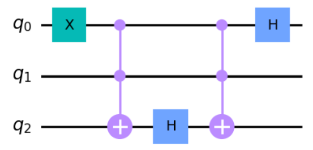

--

## 問題18

### 下記のコードでDepthはいくつになりますか？

  qc = QuantumCircuit(3,3) 
  qc.x(0) 
  qc.h(2) 
  qc.ccx(0,1,2) 
  qc.ccx(0, 1, 2) 
  qc.h(0) 
  qc.depth() 

1. 4
2. 5
3. 6
4. 7

答えはこちら

Depthは4です。

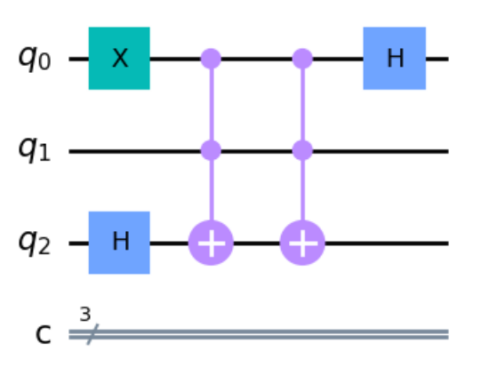

---

## 問題19

### 下記が表示されるコードは？
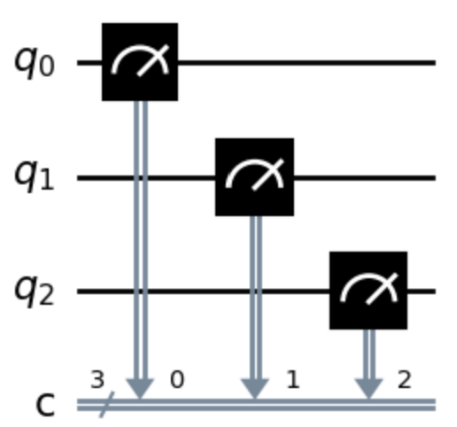

  1.  
  qc = QuantumCircuit(3,3) 
  qc.measure(0,0) 
  qc.measure(1,1) 
  qc.measure(2,2) 
  2.  
  qc = QuantumCircuit(3,3) 
  qc.measure([0,1,2],[0,1,2]) 
  3.  
  qc = QuantumCircuit(3,3) 
  qc.measure_all() 
  4.  
  qr = QuantumRegister(3, 'q') 
  cr = ClassicalRegister(3, 'c') 
  qc = QuantumCircuit(qr, cr) 
  qc.measure(qr, cr) 

答えはこちら

3.が不正解。ほかの選択肢は全て正解。 
mesure_allを利用すると、下記になります 

---

## 問題20

### 下記のコードで得られる図形は？

num_qbits = 5 
coupling_map=[[0,1],[1,2],[1,3],[3,4]] 
qbit_coordinates=[[1,0],[0,1],[1,1],[1,2],[2,1]] 
plot_coupling_map(num_qbits,qbit_coordinates,coupling_map) 
  

1.  

  

  2.  

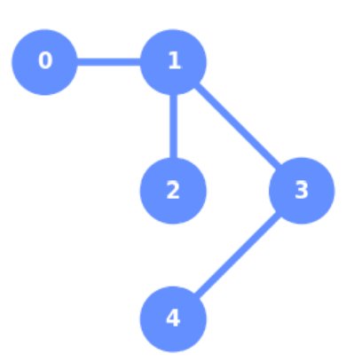  

  3.  

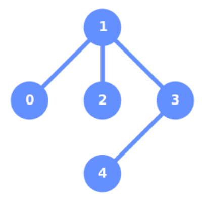  

  4.  

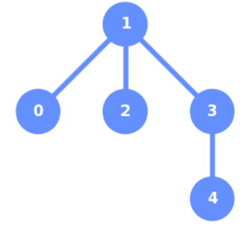  

答えはこちら

3.が正解 
coupling_mapはビット同士のつながりを示す。 
qbit_coordinatesは、０から始まる平面座標上のどこにあるかを示す。 
qbit_coordinates=[[1,0],[0,1],[1,1],[1,2],[2,1]] 
0ビットは[1,0]で、縦方向に1、横方向に0 
1ビットは[0,1]で、縦方向に0、横方向に1 
2ビットは[1,1]で、縦方向に1、横方向に1 
3ビットは[1,2]で、縦方向に1、横方向に2 
4ビットは[2,1]で、縦方向に2、横方向に1 
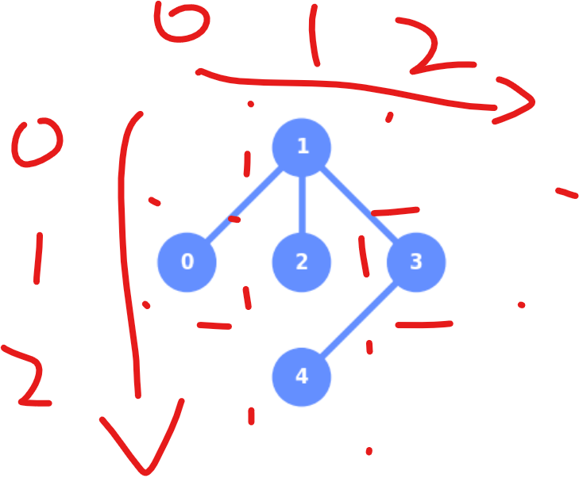  

---

## 問題21

### 下記コードの値は？

qc = QuantumCircuit(2) 
qc.cx(0,1) 
qc.measure_all() 
qc.draw() 

1. {'00': 1024}
2. {'01': 1024}
3. {'10': 1024}
4. {'11': 1024}

答えはこちら

1. {'00': 1024}

---

## 問題22

### 下記コードの値は？

qc = QuantumCircuit(2) 
qc.x(0) 
qc.measure_all() 
qc.draw() 

1. {'00': 1024}
2. {'01': 1024}
3. {'10': 1024}
4. {'11': 1024}

答えはこちら

2. {'01': 1024}

---

## 問題23

### 下記コードの値は？

qc = QuantumCircuit(3) 
qc.ccx(0,1,2) 
qc.measure_all() 
qc.draw() 

1. {'000': 1024}
2. {'001': 1024}
3. {'100': 1024}
4. {'111': 1024}

答えはこちら

1. {'000': 1024}

---

## 問題24

### 下記コードの値は？

qc = QuantumCircuit(3) 
qc.x(0) 
qc.ccx(0,1,2) 
qc.measure_all() 
qc.draw() 

1. {'000': 1024}
2. {'001': 1024}
3. {'100': 1024}
4. {'111': 1024}

答えはこちら

2. {'001': 1024}

---

## 問題25

### 下記コードの値は？

qc = QuantumCircuit(3) 
qc.x(0) 
qc.x(1) 
qc.ccx(0,1,2) 
qc.measure_all() 
qc.draw() 

1. {'000': 1024}
2. {'001': 1024}
3. {'100': 1024}
4. {'111': 1024}

答えはこちら

4. {'111': 1024}

---

## 問題26

### 以下の結果が表示されるコードは？
qc = QuantumCircuit(2) 
 
qc.h(0) 
qc.cx(0,1) 
 
#insert code 下記選択しから選んでください 

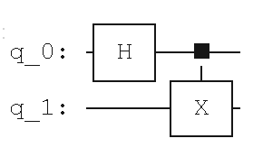  

1. qc.draw('mpl')
2. qc.draw('text')
3. print(qc)
4. qc.draw('latex_source')

答えはこちら

2. qc.draw('text')

---

## 問題27

### 以下の結果が表示されるコードは？
qc = QuantumCircuit(2) 
 
qc.h(0) 
qc.cx(0,1) 
 
#insert code 下記選択しから選んでください

  

1. qc.draw('mpl')
2. qc.draw('text')
3. print(qc)
4. qc.draw('latex_source')

答えはこちら

1. qc.draw('mpl')

---

## 問題28

### 以下の結果が表示されるコードは？
qc = QuantumCircuit(2) 
 
qc.h(0) 
qc.cx(0,1) 
 
#insert code 下記選択しから選んでください 
 

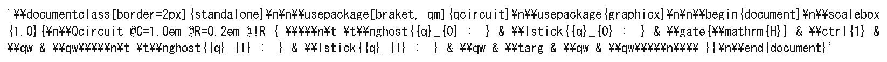  

1. qc.draw('mpl')
2. qc.draw('text')
3. print(qc)
4. qc.draw('latex_source')

答えはこちら

4. qc.draw('latex_source')

---

## 問題29

### 以下の結果が表示されるコードは？
qc = QuantumCircuit(2) 
 
qc.h(0) 
qc.cx(0,1) 
 
#insert code 下記選択しから選んでください 
 

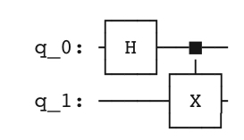  

1. qc.draw('mpl')
2. qc.draw('text')
3. print(qc)
4. qc.draw('latex_source')

答えはこちら

3. print(qc)

---

## 問題30

### 以下の結果をPng形式で保存するコードは？
qc = QuantumCircuit(2) 
 
qc.h(0) 
qc.cx(0,1) 
 
#insert code 下記選択しから選んでください

  

1. qc.draw('mpl', filename='test.png')
2. qc.draw('text', filename='test.png')
3. print(qc, filename='test.png')
4. qc.draw('latex_source', filename='test.png')

答えはこちら

1. qc.draw('mpl', filename='test.png')

---

## 問題31

### 以下のQiskit version情報を表示するコードは？

  

1. print(qiskit.__qiskit_version__)
2. %qiskit_version_table
3. print(qiskit.__version__)

答えはこちら

3. print(qiskit.__version__)

---

## 問題32

### 以下のQiskit version情報を表示するコードは？

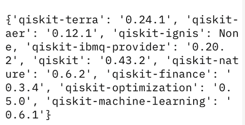  

1. print(qiskit.__qiskit_version__)
2. %qiskit_version_table
3. print(qiskit.__version__)

答えはこちら

1. print(qiskit.__qiskit_version__)

---

## 問題33

### 以下のQiskit version情報を表示するコードは？

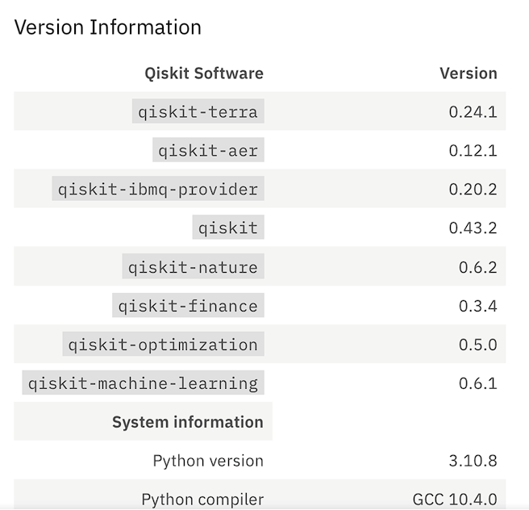  

1. print(qiskit.__qiskit_version__)
2. %qiskit_version_table
3. print(qiskit.__version__)

答えはこちら

2. %qiskit_version_table

---
以下テンプレート
改行は\# 

---

## 問題??

### 問題文text

1. 
2. 
3. 
4. 

答えはこちら

回答text

